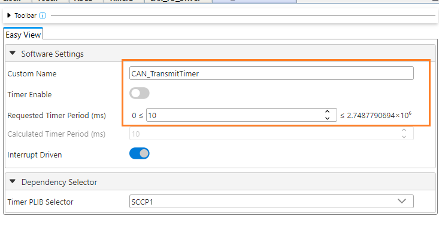

## dsPIC33C Touch CAN LIN Curiosity Development Board - Touch CAN-FD Demo

## Summary

This project demonstrates the touch functions on dsPIC33C Touch CAN LIN Curiosity Development Board using MCC- Melody driver code.

Demo code will indicate the touch position of the slider via on-board general purpose LEDs. LED1 switches on when the left most slider is pressed. LED 2-3-4-5 switches on as the touch moves towards right. Touch position is sent to CAN-FD bus.

The on-board potentiometer position is also transferred to CAN-FD bus.

## Related Documentation

[dsPIC33CK1024MP710 datasheet](https://www.microchip.com/dsPIC33CK1024MP710) for more information or specifications.

## Software Used

- [MPLAB® X IDE v6.05](https://www.microchip.com/mplabx) or newer
- [MPLAB® XC16 v2.00](https://www.microchip.com/xc16) or newer
- Device Family Pack : dsPIC33CK-MP_DFP v1.10.341
- [MPLAB® Code Configurator (MCC) 5.2.2](https://www.microchip.com/mcc) or newer

## Hardware Used

- [dsPIC33C Touch CAN LIN Curiosity Development Board](https://www.microchip.com/EV97U97A)

## Setup

**Hardware Setup**

- Connect micro-USB cable to port `J1` of Curiosity board to PC to program the device and for viewing debug messages.
- Connect CAN-FD analyzer to `J11` of Curiosity board via DB9 serial connector
- [Click here](images/hardware_setup.png) to view the hardware setup.

**MPLAB® X IDE Setup**

- Open the `dspic33c-touch-can-lin-curiosity-touch-can-fd-demo.X` project in MPLAB® X IDE
- Build and program the device

**CAN FD Analyzer Tool Setup**

- Configure CAN-FD analyzer clock to 1 Mbps nominal bit-rate and 5 Mbps data bit-rate
- Start the analyzer log to view the frames

## Operation

- When the touch position is at the left most part of the slider, LED1 turns on as the touch of the slider is moved towards right LED2-3-4-5 turns on sequentially. When touch slider is moved from right most to left most these are turned off sequentially.
- The touch value varying from 0 to 256 is sent to CAN bus every 10 ms with the message ID 0x100 (256 in decimal)
- Potentiometer value varying from 0 to 4096 is also sent to CAN bus every 10 ms with the message ID 0x200 (512 in decimal)
- Green LED blink indicates successful receive and transmit of the CAN FD message.
- Red LED On indicates CAN node is in Error state or there is Recieve Overflow error or CAN Transmit failed.

To view received and transmitted frames from CAN FD peripheral in serial terminal for debug purposes, define `UARTDEBUG_ON` in `demo_config.h`.

**Summary of the above log:**

| Message Index in the log | Description                                             | Transmitter              | Type              | Message ID in HEX | Data Length in decimal | Data in Analyzer (HEX) | Actual data (HEX) |
| ------------------------ | ------------------------------------------------------- | ------------------------ | ----------------- | ----------------- | ---------------------- | ---------------------- | ----------------- |
| 0                        | Touch position data CAN FD message in big endian format | dsPIC33C Curiosity Board | CAN FD Data Frame | 0x100 (Standard)  | 2                      | 80 00                  | 0x0080            |
| 1                        | Potentiometer data CAN FD message in big endian format  | dsPIC33C Curiosity Board | CAN FD Data Frame | 0x200 (Standard)  | 2                      | 13 06                  | 0x0613            |

## MCC settings for reference

This Project uses the driver code generated by **MCC-Melody**.
**ADC Configuration (Potentiometer)**

- ADC Configuration done in MCC Melody User Interface for potentiometer handling in this demo.  
  

**CAN-FD Configuration**

- CAN FD Driver configuration done in MCC Melody User Interface in this demo. 
   
   
   

**PIN Configuration**

- LED pins configuration in Pin Grid View: RB10, RB12, RE6, RE7, RE8, RE9 and RF11 as GPIO Output 
   
  
- Pins Table view configurations: Custom name of RB10 to `led_green`, RB12 to `led_red`, RE6 to `led1`, RE7 to `led2`, RE8 to `led3`, RE9 to `led4`and RF11 to`led5` 
  

**Timer for Touch Application**

- Timer configuration for touch application. 
  

**Timer for CAN retransmission**

- Timer configuration for serial command timeout. 
  
